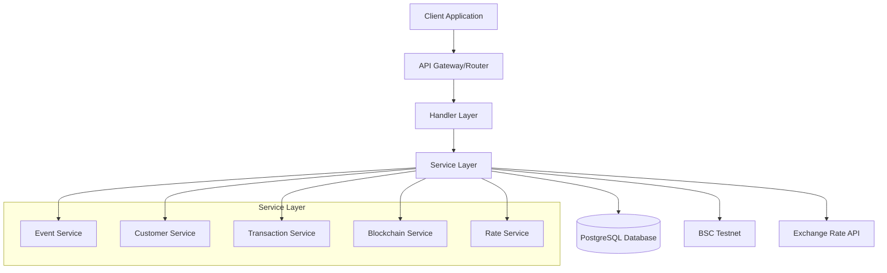

# Sermorpheus Engine - Online Ticket Reservation System

A high-performance backend system for online ticket reservations with USDT payment integration on BSC Testnet. Built with Go, featuring real-time blockchain payment monitoring and scalable architecture.

## 🚀 Features

- **Event Management**: Create and manage events with location, schedule, and pricing
- **Ticket Reservation**: Multi-ticket purchase in single transactions
- **USDT Payments**: BSC Testnet integration with real-time payment monitoring
- **Real-time Exchange Rates**: Live IDR to USDT conversion
- **Atomic Transactions**: Database consistency with rollback support
- **Payment Address Generation**: Dynamic blockchain address creation
- **Auto Payment Detection**: Background monitoring of blockchain transactions
- **RESTful API**: Clean JSON API with comprehensive error handling

## 🏗️ Architecture

### System Architecture


### Technology Stack
- **Language**: Go 1.23
- **Framework**: Gin Web Framework
- **Database**: PostgreSQL with GORM ORM
- **Blockchain**: go-ethereum for BSC Testnet
- **Configuration**: Environment-based configuration
- **Containerization**: Docker & Docker Compose

## 📊 Database Schema

See [docs/DATABASE.md](./docs/DATABASE.md) for detailed database schema documentation.

## 🔄 Payment Flow

See [docs/PAYMENT_FLOW.md](./docs/PAYMENT_FLOW.md) for detailed payment process documentation.

## 📚 API Documentation

See [docs/API.md](./docs/API.md) for complete API endpoint documentation.

## ⚙️ Configuration

See [docs/CONFIGURATION.md](./docs/CONFIGURATION.md) for environment configuration guide.

## 🚀 Quick Start

### Prerequisites
- Go 1.23+
- PostgreSQL 15+
- Docker & Docker Compose (optional)

### Environment Setup

1. **Clone the repository**
   ```bash
   git clone https://github.com/dante4rt/sermorpheus-engine-test.git
   cd sermorpheus-engine-test
   ```

2. **Configure environment**
   ```bash
   cp .env.example .env
   # Edit .env with your configuration
   ```

3. **Using Docker (Recommended)**
   ```bash
   # Start all services
   docker-compose up -d
   
   # Check logs
   docker-compose logs -f api
   ```

4. **Manual Setup**
   ```bash
   # Install dependencies
   go mod download
   
   # Setup database
   createdb sermorpheus
   
   # Run database migrations (auto-migration on startup)
   go run cmd/server/main.go
   ```

### Running the Application

#### With Docker
```bash
docker-compose up -d
```

#### Manual Run
```bash
# Start the server
go run cmd/server/main.go

# Or build and run
go build -o server cmd/server/main.go
./server
```

#### Generate Payment Addresses (First Time)
```bash
# Run seeder to generate initial payment addresses
go run cmd/seeder/main.go
```

### Verify Installation

```bash
# Health check
curl http://localhost:8080/api/health

# Get current exchange rate
curl http://localhost:8080/api/v1/rates/current
```

## 🧪 Testing the System

### 1. Create an Event
```bash
curl -X POST http://localhost:8080/api/v1/events \
  -H "Content-Type: application/json" \
  -d '{
    "name": "Web3 Workshop",
    "description": "Learn blockchain fundamentals",
    "location": "Online",
    "schedule": "2025-08-15T19:00:00+07:00",
    "price_idr": 50000,
    "quota": 100
  }'
```

### 2. Create a Transaction
```bash
curl -X POST http://localhost:8080/api/v1/transactions \
  -H "Content-Type: application/json" \
  -d '{
    "customer_email": "user@example.com",
    "customer_name": "John Doe",
    "customer_phone": "+628123456789",
    "event_id": "EVENT_ID_FROM_STEP_1",
    "quantity": 2
  }'
```

### 3. Monitor Payment
The system automatically monitors blockchain transactions. You can also manually check:
```bash
curl -X POST http://localhost:8080/api/v1/transactions/TRANSACTION_ID/check
```

## 🔧 Development

### Project Structure
```
sermorpheus-engine-test/
├── cmd/
│   ├── server/          # Main application entry point
│   └── seeder/          # Database seeder
├── internal/
│   ├── config/          # Configuration management
│   ├── handlers/        # HTTP request handlers
│   ├── models/          # Database models
│   ├── services/        # Business logic
│   └── utils/           # Utility functions
├── scripts/
│   └── init.sql         # Database initialization
├── docker-compose.yml   # Docker services
├── Dockerfile          # Application container
└── .env.example        # Configuration template
```

### Key Services

- **Event Service**: Manages events and quotas
- **Customer Service**: Handles customer data
- **Transaction Service**: Manages ticket purchases
- **Blockchain Service**: BSC integration and payment monitoring
- **Rate Service**: Exchange rate management

### Database Models

- **Event**: Event information and quota management
- **Customer**: Customer data with unique email constraint
- **Transaction**: Purchase transactions with payment tracking
- **Ticket**: Individual tickets generated per transaction
- **PaymentAddress**: Dynamically generated payment addresses
- **BlockchainTransaction**: Blockchain transaction records
- **USDTRate**: Exchange rate history

## 🔐 Security Features

- **Environment-based Configuration**: No hardcoded credentials
- **Database Transactions**: Atomic operations with rollback
- **Input Validation**: Request validation with Gin binding
- **SQL Injection Prevention**: GORM parameterized queries
- **Secure Key Management**: Private key generation and storage
- **Address Validation**: Ethereum address format validation

## 📈 Performance Features

- **Async Payment Monitoring**: Non-blocking blockchain monitoring
- **Connection Pooling**: Database connection optimization
- **Rate Limit Handling**: BSC Testnet rate limit awareness
- **Efficient Querying**: Optimized database queries
- **Graceful Degradation**: Continues operation if blockchain unavailable

## 🛠️ Troubleshooting

### Common Issues

1. **Database Connection Failed**
   ```bash
   # Check PostgreSQL is running
   pg_isready -h localhost -p 5432
   
   # Verify DATABASE_URL in .env
   ```

2. **Blockchain Connection Issues**
   ```bash
   # Check BSC_RPC_URL accessibility
   curl -X POST BSC_RPC_URL -H "Content-Type: application/json" -d '{"jsonrpc":"2.0","method":"eth_blockNumber","params":[],"id":1}'
   ```

3. **Payment Not Detected**
   ```bash
   # Check transaction manually
   curl -X POST http://localhost:8080/api/v1/transactions/TX_ID/check
   ```

### Logs
```bash
# View application logs
docker-compose logs -f api

# View all service logs
docker-compose logs -f
```

## 🔗 Related Documentation

- [API Documentation](./docs/API.md) - Complete API reference
- [Database Schema](./docs/DATABASE.md) - Database design and relationships
- [Payment Flow](./docs/PAYMENT_FLOW.md) - Payment process documentation
- [Configuration Guide](./docs/CONFIGURATION.md) - Environment setup guide
