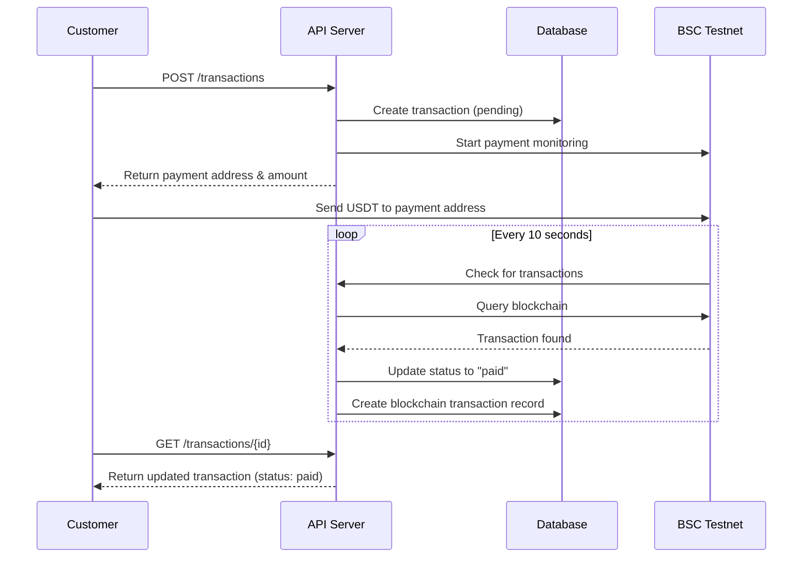

# API Documentation

Complete REST API reference for the Sermorpheus Engine ticket reservation system.

## Base URL
```
http://localhost:8080/api/v1
```

## Response Format

All API responses follow a consistent format:

```json
{
  "success": true,
  "message": "Operation completed successfully",
  "data": {
    // Response data here
  },
  "timestamp": "2025-07-30T15:30:00Z"
}
```

Error responses:
```json
{
  "success": false,
  "message": "Error description",
  "error": "Detailed error message",
  "timestamp": "2025-07-30T15:30:00Z"
}
```

## Authentication

No authentication required. All endpoints are publicly accessible.

## Endpoints

### Health Check

#### GET /api/health
Check system health and status.

**Response:**
```json
{
  "status": "healthy",
  "service": "sermorpheus-engine"
}
```

---

## Events

### Create Event

#### POST /api/v1/events

Create a new event with tickets.

**Request Body:**
```json
{
  "name": "Web3 Workshop",
  "description": "Learn blockchain fundamentals",
  "location": "Online",
  "schedule": "2025-08-15T19:00:00+07:00",
  "price_idr": 50000,
  "quota": 100
}
```

**Required Fields:**
- `name` (string): Event name
- `location` (string): Event location
- `schedule` (string): ISO 8601 datetime
- `price_idr` (number): Price in Indonesian Rupiah
- `quota` (number): Available ticket quota

**Optional Fields:**
- `description` (string): Event description

**Response:**
```json
{
  "success": true,
  "message": "Event created successfully",
  "data": {
    "id": "550e8400-e29b-41d4-a716-446655440000",
    "name": "Web3 Workshop",
    "description": "Learn blockchain fundamentals",
    "location": "Online",
    "schedule": "2025-08-15T19:00:00+07:00",
    "price_idr": 50000,
    "quota": 100,
    "available_quota": 100,
    "created_at": "2025-07-30T15:30:00Z",
    "updated_at": "2025-07-30T15:30:00Z"
  }
}
```

### List Events

#### GET /api/v1/events

Retrieve all events with pagination.

**Query Parameters:**
- `page` (optional): Page number (default: 1)
- `limit` (optional): Items per page (default: 10, max: 100)

**Response:**
```json
{
  "success": true,
  "message": "Events retrieved successfully",
  "data": {
    "events": [
      {
        "id": "550e8400-e29b-41d4-a716-446655440000",
        "name": "Web3 Workshop",
        "description": "Learn blockchain fundamentals",
        "location": "Online",
        "schedule": "2025-08-15T19:00:00+07:00",
        "price_idr": 50000,
        "quota": 100,
        "available_quota": 98,
        "created_at": "2025-07-30T15:30:00Z",
        "updated_at": "2025-07-30T15:30:00Z"
      }
    ],
    "pagination": {
      "page": 1,
      "limit": 10,
      "total": 1,
      "total_pages": 1
    }
  }
}
```

### Get Event by ID

#### GET /api/v1/events/{id}

Retrieve a specific event by ID.

**Path Parameters:**
- `id` (string): Event UUID

**Response:**
```json
{
  "success": true,
  "message": "Event retrieved successfully",
  "data": {
    "id": "550e8400-e29b-41d4-a716-446655440000",
    "name": "Web3 Workshop",
    "description": "Learn blockchain fundamentals",
    "location": "Online",
    "schedule": "2025-08-15T19:00:00+07:00",
    "price_idr": 50000,
    "quota": 100,
    "available_quota": 98,
    "created_at": "2025-07-30T15:30:00Z",
    "updated_at": "2025-07-30T15:30:00Z"
  }
}
```

---

## Customers

### Get Customer

#### GET /api/v1/customers/{id}

Retrieve customer information by ID.

**Path Parameters:**
- `id` (string): Customer UUID

**Response:**
```json
{
  "success": true,
  "message": "Customer retrieved successfully",
  "data": {
    "id": "660e8400-e29b-41d4-a716-446655440000",
    "email": "john.doe@example.com",
    "name": "John Doe",
    "phone": "+628123456789",
    "created_at": "2025-07-30T15:30:00Z",
    "updated_at": "2025-07-30T15:30:00Z"
  }
}
```

---

## Transactions

### Create Transaction

#### POST /api/v1/transactions

Create a new ticket purchase transaction.

**Request Body:**
```json
{
  "customer_email": "john.doe@example.com",
  "customer_name": "John Doe",
  "customer_phone": "+628123456789",
  "event_id": "550e8400-e29b-41d4-a716-446655440000",
  "quantity": 2
}
```

**Required Fields:**
- `customer_email` (string): Valid email address
- `customer_name` (string): Customer full name
- `event_id` (string): Event UUID
- `quantity` (number): Number of tickets (> 0)

**Optional Fields:**
- `customer_phone` (string): Phone number

**Response:**
```json
{
  "success": true,
  "message": "Transaction created successfully",
  "data": {
    "transaction": {
      "id": "770e8400-e29b-41d4-a716-446655440000",
      "customer_id": "660e8400-e29b-41d4-a716-446655440000",
      "event_id": "550e8400-e29b-41d4-a716-446655440000",
      "quantity": 2,
      "total_idr": 100000,
      "usdt_rate": 16394.58,
      "usdt_amount": 6.173456,
      "payment_address": "0xbAc99c8Ca5f37dbCE580F13AB924374168a173e1",
      "status": "pending",
      "payment_locked_at": "2025-07-30T15:30:00Z",
      "created_at": "2025-07-30T15:30:00Z",
      "updated_at": "2025-07-30T15:30:00Z"
    },
    "payment_address": "0xbAc99c8Ca5f37dbCE580F13AB924374168a173e1",
    "usdt_amount": 6.173456,
    "payment_deadline": "2025-07-30T16:00:00Z"
  }
}
```

### Get Transaction

#### GET /api/v1/transactions/{id}

Retrieve transaction details by ID.

**Path Parameters:**
- `id` (string): Transaction UUID

**Response:**
```json
{
  "success": true,
  "message": "Transaction retrieved successfully",
  "data": {
    "id": "770e8400-e29b-41d4-a716-446655440000",
    "customer_id": "660e8400-e29b-41d4-a716-446655440000",
    "event_id": "550e8400-e29b-41d4-a716-446655440000",
    "quantity": 2,
    "total_idr": 100000,
    "usdt_rate": 16394.58,
    "usdt_amount": 6.173456,
    "payment_address": "0xbAc99c8Ca5f37dbCE580F13AB924374168a173e1",
    "status": "paid",
    "payment_locked_at": "2025-07-30T15:30:00Z",
    "payment_confirmed_at": "2025-07-30T15:35:00Z",
    "created_at": "2025-07-30T15:30:00Z",
    "updated_at": "2025-07-30T15:35:00Z",
    "customer": {
      "id": "660e8400-e29b-41d4-a716-446655440000",
      "email": "john.doe@example.com",
      "name": "John Doe",
      "phone": "+628123456789"
    },
    "event": {
      "id": "550e8400-e29b-41d4-a716-446655440000",
      "name": "Web3 Workshop",
      "location": "Online",
      "schedule": "2025-08-15T19:00:00+07:00"
    },
    "tickets": [
      {
        "id": "880e8400-e29b-41d4-a716-446655440000",
        "ticket_code": "TIX-770e8400-1",
        "status": "active"
      },
      {
        "id": "990e8400-e29b-41d4-a716-446655440000",
        "ticket_code": "TIX-770e8400-2",
        "status": "active"
      }
    ]
  }
}
```

### Check Payment

#### POST /api/v1/transactions/{id}/check-payment

Manually trigger payment verification for a transaction.

**Path Parameters:**
- `id` (string): Transaction UUID

**Response:**
```json
{
  "success": true,
  "message": "Payment check initiated",
  "data": {
    "transaction_id": "770e8400-e29b-41d4-a716-446655440000",
    "checking": true
  }
}
```

### Confirm Payment (Manual)

#### POST /api/v1/transactions/{id}/confirm

Manually confirm payment with transaction hash.

**Path Parameters:**
- `id` (string): Transaction UUID

**Request Body:**
```json
{
  "tx_hash": "0x1234567890abcdef...",
  "amount": 6.173456
}
```

**Required Fields:**
- `tx_hash` (string): Blockchain transaction hash

**Optional Fields:**
- `amount` (number): Confirmed amount

**Response:**
```json
{
  "success": true,
  "message": "Payment confirmed successfully",
  "data": null
}
```

---

## Exchange Rates

### Get Current Rate

#### GET /api/v1/rates/current

Get the current IDR to USDT exchange rate.

**Response:**
```json
{
  "success": true,
  "message": "Current rate retrieved successfully",
  "data": {
    "id": "aa0e8400-e29b-41d4-a716-446655440000",
    "idr_to_usdt_rate": 16394.58,
    "created_at": "2025-07-30T15:30:00Z"
  }
}
```

---

## Error Codes

| Status Code | Description |
|------------|-------------|
| 200 | Success |
| 201 | Created |
| 400 | Bad Request - Invalid input data |
| 404 | Not Found - Resource doesn't exist |
| 500 | Internal Server Error |

## Common Error Scenarios

### 400 Bad Request
```json
{
  "success": false,
  "message": "Invalid request data",
  "error": "quantity must be greater than 0",
  "timestamp": "2025-07-30T15:30:00Z"
}
```

### 404 Not Found
```json
{
  "success": false,
  "message": "Event not found",
  "error": "record not found",
  "timestamp": "2025-07-30T15:30:00Z"
}
```

### 500 Internal Server Error
```json
{
  "success": false,
  "message": "Failed to create transaction",
  "error": "insufficient tickets available",
  "timestamp": "2025-07-30T15:30:00Z"
}
```

## Rate Limiting

Currently no rate limiting is implemented. All endpoints can be called without restrictions.

## Webhooks

The system doesn't provide webhooks but uses real-time blockchain monitoring to automatically detect payments.

## Example Workflows

### Complete Ticket Purchase Flow

1. **Get available events**
   ```bash
   curl -X GET http://localhost:8080/api/v1/events
   ```

2. **Create transaction**
   ```bash
   curl -X POST http://localhost:8080/api/v1/transactions \
     -H "Content-Type: application/json" \
     -d '{
       "customer_email": "user@example.com",
       "customer_name": "John Doe",
       "event_id": "550e8400-e29b-41d4-a716-446655440000",
       "quantity": 1
     }'
   ```

3. **Customer sends USDT to payment_address**

4. **System automatically detects payment and updates status**

5. **Check transaction status**
   ```bash
   curl -X GET http://localhost:8080/api/v1/transactions/770e8400-e29b-41d4-a716-446655440000
   ```

### Payment Verification Flow


