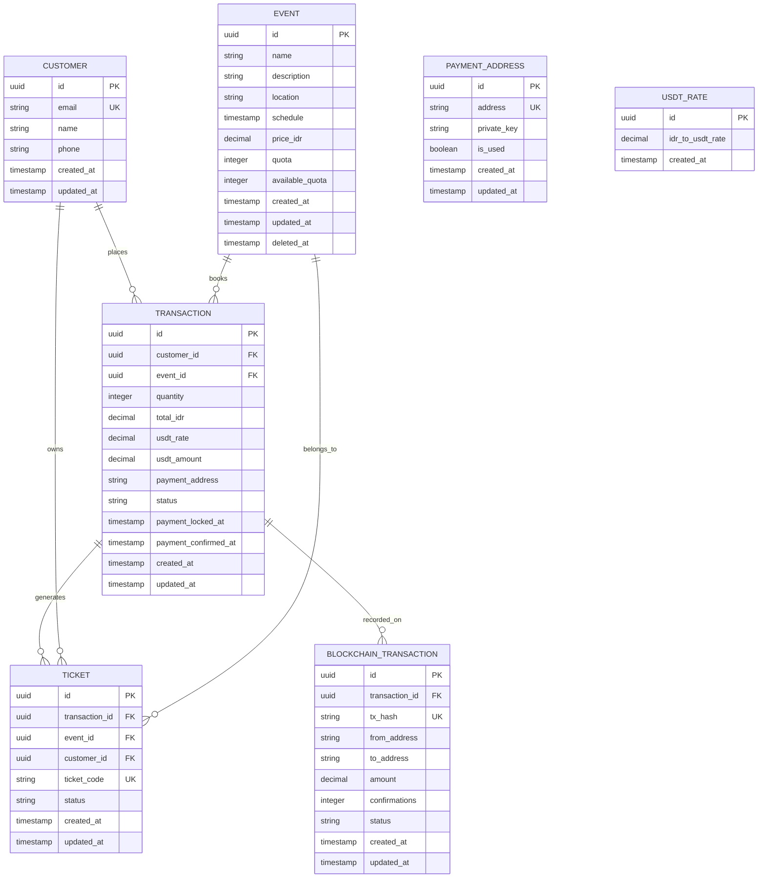

# Database Schema Documentation

Complete database schema and Entity Relationship Diagram for the Sermorpheus Engine ticket reservation system.

## Database Technology

- **Database**: PostgreSQL 15+
- **ORM**: GORM (Go Object-Relational Mapping)
- **Migration**: Auto-migration on application startup
- **Features**: UUID primary keys, soft deletes, timestamps

## Entity Relationship Diagram



## Table Definitions

### events
Primary table for event management.

| Column | Type | Constraints | Description |
|--------|------|-------------|-------------|
| id | UUID | PRIMARY KEY, DEFAULT gen_random_uuid() | Unique event identifier |
| name | VARCHAR | NOT NULL | Event name |
| description | TEXT | | Event description |
| location | VARCHAR | NOT NULL | Event location |
| schedule | TIMESTAMP | NOT NULL | Event date and time |
| price_idr | DECIMAL | NOT NULL | Ticket price in IDR |
| quota | INTEGER | NOT NULL | Total available tickets |
| available_quota | INTEGER | NOT NULL | Remaining tickets |
| created_at | TIMESTAMP | AUTO | Record creation time |
| updated_at | TIMESTAMP | AUTO | Last update time |
| deleted_at | TIMESTAMP | INDEX | Soft delete timestamp |

**Indexes:**
- PRIMARY KEY on `id`
- INDEX on `deleted_at`
- INDEX on `schedule`

### customers
Customer information storage.

| Column | Type | Constraints | Description |
|--------|------|-------------|-------------|
| id | UUID | PRIMARY KEY, DEFAULT gen_random_uuid() | Unique customer identifier |
| email | VARCHAR | UNIQUE, NOT NULL | Customer email address |
| name | VARCHAR | NOT NULL | Customer full name |
| phone | VARCHAR | | Customer phone number |
| created_at | TIMESTAMP | AUTO | Record creation time |
| updated_at | TIMESTAMP | AUTO | Last update time |

**Indexes:**
- PRIMARY KEY on `id`
- UNIQUE INDEX on `email`

### transactions
Core transaction records for ticket purchases.

| Column | Type | Constraints | Description |
|--------|------|-------------|-------------|
| id | UUID | PRIMARY KEY, DEFAULT gen_random_uuid() | Unique transaction identifier |
| customer_id | UUID | FOREIGN KEY, NOT NULL | Reference to customer |
| event_id | UUID | FOREIGN KEY, NOT NULL | Reference to event |
| quantity | INTEGER | NOT NULL | Number of tickets purchased |
| total_idr | DECIMAL | NOT NULL | Total amount in IDR |
| usdt_rate | DECIMAL | NOT NULL | Exchange rate at transaction time |
| usdt_amount | DECIMAL | NOT NULL | Required USDT amount |
| payment_address | VARCHAR | | Blockchain payment address |
| status | VARCHAR | DEFAULT 'pending' | Transaction status |
| payment_locked_at | TIMESTAMP | | Rate lock timestamp |
| payment_confirmed_at | TIMESTAMP | | Payment confirmation timestamp |
| created_at | TIMESTAMP | AUTO | Record creation time |
| updated_at | TIMESTAMP | AUTO | Last update time |

**Indexes:**
- PRIMARY KEY on `id`
- FOREIGN KEY on `customer_id` → `customers(id)`
- FOREIGN KEY on `event_id` → `events(id)`
- INDEX on `status`
- INDEX on `payment_address`

**Status Values:**
- `pending`: Awaiting payment
- `paid`: Payment confirmed
- `expired`: Payment deadline exceeded
- `cancelled`: Transaction cancelled

### tickets
Individual ticket records generated from transactions.

| Column | Type | Constraints | Description |
|--------|------|-------------|-------------|
| id | UUID | PRIMARY KEY, DEFAULT gen_random_uuid() | Unique ticket identifier |
| transaction_id | UUID | FOREIGN KEY, NOT NULL | Reference to transaction |
| event_id | UUID | FOREIGN KEY, NOT NULL | Reference to event |
| customer_id | UUID | FOREIGN KEY, NOT NULL | Reference to customer |
| ticket_code | VARCHAR | UNIQUE, NOT NULL | Human-readable ticket code |
| status | VARCHAR | DEFAULT 'active' | Ticket status |
| created_at | TIMESTAMP | AUTO | Record creation time |
| updated_at | TIMESTAMP | AUTO | Last update time |

**Indexes:**
- PRIMARY KEY on `id`
- UNIQUE INDEX on `ticket_code`
- FOREIGN KEY on `transaction_id` → `transactions(id)`
- FOREIGN KEY on `event_id` → `events(id)`
- FOREIGN KEY on `customer_id` → `customers(id)`

**Status Values:**
- `active`: Valid ticket
- `used`: Ticket has been used
- `cancelled`: Ticket cancelled

**Ticket Code Format:** `TIX-{transaction_id_prefix}-{sequence_number}`

### payment_addresses
Dynamically generated blockchain payment addresses.

| Column | Type | Constraints | Description |
|--------|------|-------------|-------------|
| id | UUID | PRIMARY KEY, DEFAULT gen_random_uuid() | Unique address identifier |
| address | VARCHAR | UNIQUE, NOT NULL | Ethereum address |
| private_key | VARCHAR | NOT NULL | Private key (encrypted) |
| is_used | BOOLEAN | DEFAULT false | Address usage status |
| created_at | TIMESTAMP | AUTO | Record creation time |
| updated_at | TIMESTAMP | AUTO | Last update time |

**Indexes:**
- PRIMARY KEY on `id`
- UNIQUE INDEX on `address`
- INDEX on `is_used`

### usdt_rates
Exchange rate history for IDR to USDT conversion.

| Column | Type | Constraints | Description |
|--------|------|-------------|-------------|
| id | UUID | PRIMARY KEY, DEFAULT gen_random_uuid() | Unique rate identifier |
| idr_to_usdt_rate | DECIMAL | NOT NULL | IDR to USDT exchange rate |
| created_at | TIMESTAMP | AUTO | Rate timestamp |

**Indexes:**
- PRIMARY KEY on `id`
- INDEX on `created_at`

### blockchain_transactions
Blockchain transaction records for payment tracking.

| Column | Type | Constraints | Description |
|--------|------|-------------|-------------|
| id | UUID | PRIMARY KEY, DEFAULT gen_random_uuid() | Unique record identifier |
| transaction_id | UUID | FOREIGN KEY, NOT NULL | Reference to transaction |
| tx_hash | VARCHAR | UNIQUE | Blockchain transaction hash |
| from_address | VARCHAR | | Sender address |
| to_address | VARCHAR | | Recipient address |
| amount | DECIMAL | | Transfer amount |
| confirmations | INTEGER | DEFAULT 0 | Block confirmations |
| status | VARCHAR | DEFAULT 'pending' | Transaction status |
| created_at | TIMESTAMP | AUTO | Record creation time |
| updated_at | TIMESTAMP | AUTO | Last update time |

**Indexes:**
- PRIMARY KEY on `id`
- UNIQUE INDEX on `tx_hash`
- FOREIGN KEY on `transaction_id` → `transactions(id)`
- INDEX on `status`

**Status Values:**
- `pending`: Transaction submitted
- `confirmed`: Transaction confirmed
- `failed`: Transaction failed

## Database Relationships

### One-to-Many Relationships

1. **Customer → Transactions**
   - One customer can have multiple transactions
   - Foreign key: `transactions.customer_id`

2. **Event → Transactions**
   - One event can have multiple transactions
   - Foreign key: `transactions.event_id`

3. **Transaction → Tickets**
   - One transaction generates multiple tickets
   - Foreign key: `tickets.transaction_id`

4. **Customer → Tickets**
   - One customer can own multiple tickets
   - Foreign key: `tickets.customer_id`

5. **Event → Tickets**
   - One event can have multiple tickets
   - Foreign key: `tickets.event_id`

6. **Transaction → Blockchain Transactions**
   - One transaction can have multiple blockchain records
   - Foreign key: `blockchain_transactions.transaction_id`

## Data Integrity Constraints

### Business Rules Enforced by Database

1. **Email Uniqueness**: Each customer email must be unique
2. **Ticket Code Uniqueness**: Each ticket code must be unique
3. **Address Uniqueness**: Each payment address must be unique
4. **Transaction Hash Uniqueness**: Each blockchain transaction hash must be unique
5. **Positive Quantities**: All quantity fields must be positive
6. **Valid Status Values**: Status fields are constrained to predefined values

### Application-Level Constraints

1. **Quota Management**: Available quota cannot be negative
2. **Payment Validation**: USDT amount must match calculated amount
3. **Address Usage**: Payment addresses marked as used cannot be reused
4. **Transaction Atomicity**: Ticket generation and quota update happen atomically

## Performance Optimizations

### Indexing Strategy

```sql
-- Primary indexes (auto-created)
CREATE INDEX idx_events_deleted_at ON events(deleted_at);
CREATE INDEX idx_events_schedule ON events(schedule);

-- Foreign key indexes (auto-created by GORM)
CREATE INDEX idx_transactions_customer_id ON transactions(customer_id);
CREATE INDEX idx_transactions_event_id ON transactions(event_id);
CREATE INDEX idx_tickets_transaction_id ON tickets(transaction_id);
CREATE INDEX idx_tickets_event_id ON tickets(event_id);
CREATE INDEX idx_tickets_customer_id ON tickets(customer_id);

-- Business logic indexes
CREATE INDEX idx_transactions_status ON transactions(status);
CREATE INDEX idx_transactions_payment_address ON transactions(payment_address);
CREATE INDEX idx_payment_addresses_is_used ON payment_addresses(is_used);
CREATE INDEX idx_usdt_rates_created_at ON usdt_rates(created_at);
CREATE INDEX idx_blockchain_transactions_status ON blockchain_transactions(status);
```

### Query Optimization

1. **Event Listing**: Indexed by schedule and soft delete
2. **Customer Lookup**: Indexed by email for fast authentication
3. **Payment Monitoring**: Indexed by payment address and status
4. **Rate Retrieval**: Indexed by creation time for latest rates

## Migration Strategy

### Auto-Migration
The application uses GORM's auto-migration feature:

```go
// Automatic schema creation/updates on startup
db.AutoMigrate(
    &models.Event{},
    &models.Customer{},
    &models.Transaction{},
    &models.Ticket{},
    &models.PaymentAddress{},
    &models.USDTRate{},
    &models.BlockchainTransaction{},
)
```

### Manual Schema Setup
For production environments, use the provided SQL schema:

```bash
# Initialize database
psql -U username -d database_name -f scripts/init.sql
```

## Backup and Recovery

### Recommended Backup Strategy

1. **Full Backup**: Daily full database backup
2. **Transaction Log Backup**: Every 15 minutes
3. **Point-in-Time Recovery**: Enabled for critical data protection

### Critical Tables Priority

1. **transactions**: Core business data
2. **customers**: Customer information
3. **tickets**: Generated tickets
4. **blockchain_transactions**: Payment records
5. **events**: Event information
6. **payment_addresses**: Payment infrastructure
7. **usdt_rates**: Exchange rate history

## Security Considerations

### Data Protection

1. **Private Keys**: Stored securely (consider encryption at rest)
2. **Customer Data**: Email and personal information protection
3. **Payment Data**: Blockchain addresses and transaction hashes
4. **Access Control**: Database user permissions and connection security

### Audit Trail

All tables include `created_at` and `updated_at` timestamps for audit purposes. Critical operations are logged through the application layer.

## Database Configuration

### Recommended PostgreSQL Settings

```sql
-- Connection settings
max_connections = 100
shared_buffers = 256MB
effective_cache_size = 1GB

-- Performance settings
random_page_cost = 1.1
effective_io_concurrency = 200
work_mem = 4MB
maintenance_work_mem = 64MB

-- Logging
log_statement = 'mod'
log_duration = on
log_min_duration_statement = 1000
```

This schema design ensures data integrity, performance, and scalability for the ticket reservation system while supporting real-time blockchain payment processing.
