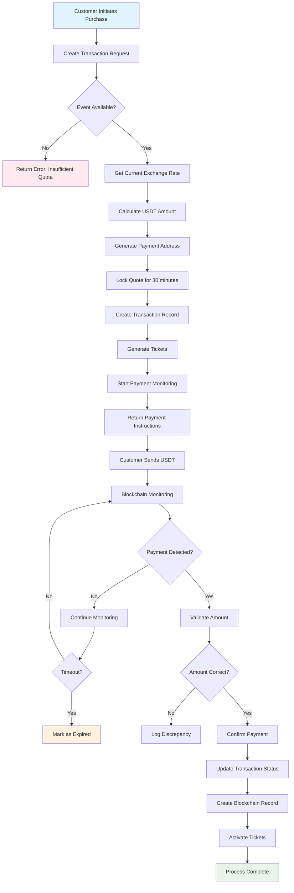
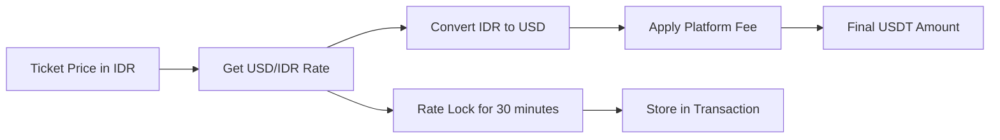
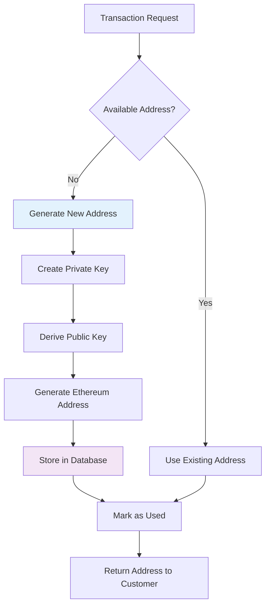
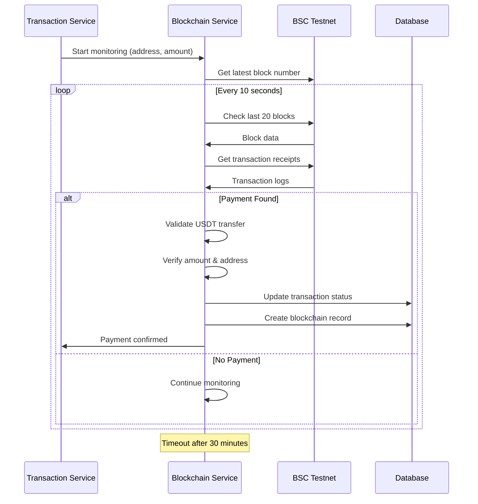
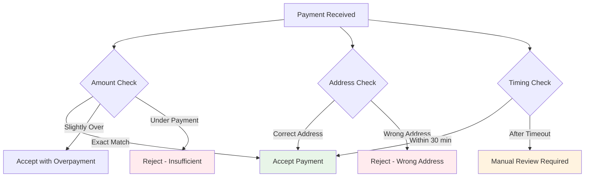
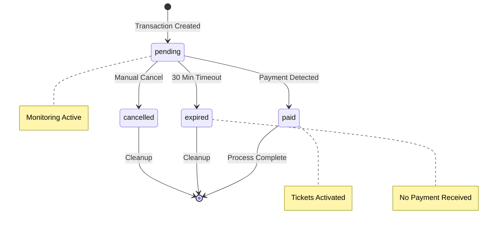

# Payment Flow Documentation

Comprehensive documentation of the USDT payment process on BSC Testnet for the Sermorpheus Engine ticket reservation system.

## Overview

The payment system enables customers to purchase event tickets using USDT (Tether) on the Binance Smart Chain (BSC) Testnet. The system handles real-time exchange rate conversion, payment address generation, and automatic payment detection.

## Payment Flow Architecture



## Exchange Rate Calculation

### Rate Source
The system fetches live exchange rates from a reliable external API:

```
Source: exchangerate-api.com
Endpoint: USD to IDR conversion
Update Frequency: On-demand per transaction
```

### Calculation Process



### Calculation Formula

1. **Base Conversion**:
   ```
   USD_amount = IDR_amount / IDR_to_USD_rate
   ```

2. **Platform Fee**:
   ```
   fee_amount = USD_amount × (platform_fee_percent / 100)
   final_amount = USD_amount + fee_amount
   ```

3. **USDT Precision**:
   ```
   usdt_amount = round(final_amount, 6)  // 6 decimal places for BSC Testnet
   ```

### Example Calculation

```
Ticket Price: 50,000 IDR
Exchange Rate: 16,394.58 IDR/USD
Platform Fee: 1.2%

Step 1: 50,000 ÷ 16,394.58 = 3.049518 USD
Step 2: 3.049518 × 0.012 = 0.036594 USD (fee)
Step 3: 3.049518 + 0.036594 = 3.086112 USD
Step 4: Round to 6 decimals = 3.086112 USDT
```

## Payment Address Generation

### Dynamic Address Creation



### Security Considerations

1. **Private Key Generation**: Uses secure cryptographic randomness
2. **Storage**: Private keys stored in database (consider encryption)
3. **Usage**: Each address used once per transaction
4. **Validation**: Ethereum address format validation

### Address Pool Management

```go
// Address lifecycle
type PaymentAddress struct {
    ID         uuid.UUID
    Address    string    // 0x... format
    PrivateKey string    // Hex encoded
    IsUsed     bool      // Single-use flag
    CreatedAt  time.Time
}
```

## Blockchain Monitoring System

### Real-time Payment Detection



### Monitoring Algorithm

1. **Block Scanning**: Check recent blocks for USDT transfers
2. **Log Filtering**: Filter Transfer events for USDT contract
3. **Address Matching**: Match recipient address
4. **Amount Validation**: Verify transfer amount
5. **Status Update**: Update transaction and create record

### BSC Testnet Configuration

```
RPC Endpoint: https://data-seed-prebsc-1-s1.binance.org:8545
USDT Contract: 0xCD60747D9Bbb1da2AfB2F834391f0FF6ccb15f1a
Decimals: 6
Network ID: 97
```

### Rate Limit Handling

The system implements BSC Testnet rate limit awareness:

```go
// Rate limit protection
time.Sleep(100 * time.Millisecond) // Between block requests
```

## Payment Validation Process

### Amount Tolerance

The system uses a small tolerance for amount validation:

```go
tolerance := math.Max(expectedAmount*0.001, 0.000001)
isValid := receivedAmount >= (expectedAmount - tolerance) && 
           receivedAmount <= (expectedAmount + tolerance)
```

### Validation Rules

1. **Minimum Amount**: Must meet or exceed expected amount
2. **Maximum Tolerance**: 0.1% variance or 0.000001 USDT minimum
3. **Address Match**: Must be sent to exact payment address
4. **Contract Verification**: Must be USDT token transfer
5. **Duplicate Prevention**: Each transaction hash processed once

## Error Handling and Edge Cases

### Common Scenarios



### Error Recovery

1. **Underpayment**: Customer can send additional payment
2. **Overpayment**: System accepts and logs excess
3. **Wrong Address**: Manual intervention required
4. **Network Issues**: Retry mechanism with exponential backoff
5. **Rate Limit**: Graceful degradation with retry

## Transaction States

### State Diagram



### State Transitions

| From State | To State | Trigger | Action |
|------------|----------|---------|---------|
| pending | paid | Payment detected | Activate tickets, create blockchain record |
| pending | expired | 30 min timeout | Stop monitoring, mark expired |
| pending | cancelled | Manual action | Stop monitoring, release quota |
| paid | [none] | Final state | Transaction complete |

## Performance Metrics

### Monitoring Efficiency

- **Block Check Interval**: 10 seconds
- **Block Range**: Last 20 blocks
- **Timeout Duration**: 30 minutes
- **Detection Latency**: ~10-30 seconds average

### Scalability Considerations

1. **Concurrent Monitoring**: Multiple transactions monitored simultaneously
2. **Resource Usage**: Optimized for BSC Testnet rate limits
3. **Database Performance**: Indexed queries for fast lookups
4. **Memory Usage**: Efficient goroutine management

## Security Features

### Payment Security

1. **Address Verification**: Cryptographically secure address generation
2. **Amount Validation**: Precise decimal handling
3. **Duplicate Prevention**: Transaction hash uniqueness
4. **Timeout Protection**: Automatic expiration handling
5. **Audit Trail**: Complete payment history logging

### Fraud Prevention

1. **Single-use Addresses**: Each address used once
2. **Time-locked Rates**: Prevents rate manipulation
3. **Amount Tolerance**: Minimal acceptable variance
4. **Blockchain Verification**: Cannot be spoofed
5. **Complete Logging**: Full audit trail

## Integration Points

### External Dependencies

1. **Exchange Rate API**: Live rate fetching
2. **BSC Testnet RPC**: Blockchain communication
3. **PostgreSQL**: Data persistence
4. **USDT Contract**: Token transfer validation

### Webhook Alternative

While the system doesn't provide webhooks, it offers real-time status checking:

```bash
# Check payment status
GET /api/v1/transactions/{id}

# Manual payment check
POST /api/v1/transactions/{id}/check
```

## Troubleshooting Guide

### Common Issues

1. **Payment Not Detected**
   - Check BSC RPC connectivity
   - Verify USDT contract address
   - Confirm customer sent to correct address

2. **Rate Calculation Errors**
   - Verify exchange rate API accessibility
   - Check platform fee configuration
   - Validate decimal precision

3. **Monitoring Failures**
   - Check BSC Testnet status
   - Verify rate limit compliance
   - Review error logs

### Diagnostic Commands

```bash
# Check current exchange rate
curl -X GET http://localhost:8080/api/v1/rates/current

# Manual payment verification
curl -X POST http://localhost:8080/api/v1/transactions/{id}/check

# View transaction details
curl -X GET http://localhost:8080/api/v1/transactions/{id}
```

This payment flow ensures reliable, secure, and efficient processing of USDT payments while maintaining transparency and auditability throughout the entire process.
