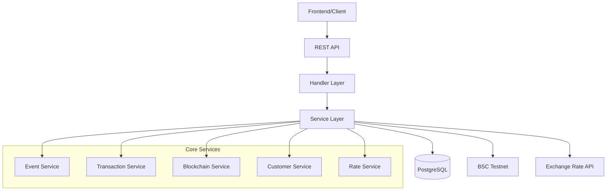

# Documentation Index

Welcome to the Sermorpheus Engine documentation. This directory contains comprehensive documentation for the online ticket reservation system with USDT payment integration.

## 📁 Documentation Files

### Core Documentation

- **[API.md](./API.md)** - Complete REST API reference with all endpoints, request/response examples, and usage guidelines
- **[DATABASE.md](./DATABASE.md)** - Database schema documentation with ERD, table definitions, and relationships
- **[PAYMENT_FLOW.md](./PAYMENT_FLOW.md)** - Detailed payment process documentation including blockchain integration and exchange rate handling
- **[CONFIGURATION.md](./CONFIGURATION.md)** - Environment configuration guide for different deployment scenarios

### Additional Documentation

- **[DOCUMENTATION.md](./DOCUMENTATION.md)** - Project overview and documentation summary with navigation guide

## 📋 Quick Navigation

### For Developers Starting Out

1. Read the [main README](../README.md) for project overview
2. Check [CONFIGURATION.md](./CONFIGURATION.md) for setup
3. Review [API.md](./API.md) for endpoint specifications
4. Understand [DATABASE.md](./DATABASE.md) for data models

### For Integration Work

1. [API.md](./API.md) - All endpoint details
2. [PAYMENT_FLOW.md](./PAYMENT_FLOW.md) - Payment integration guide
3. [CONFIGURATION.md](./CONFIGURATION.md) - Environment setup

### For Database Work

1. [DATABASE.md](./DATABASE.md) - Complete schema documentation
2. [../scripts/init.sql](../scripts/init.sql) - Database initialization script

### For Deployment/DevOps

1. [CONFIGURATION.md](./CONFIGURATION.md) - Environment configuration
2. [../README.md](../README.md) - Docker and deployment instructions
3. [../docker-compose.yml](../docker-compose.yml) - Container orchestration

## 🏗️ System Overview

The Sermorpheus Engine is a backend system for online ticket reservations featuring:

- **Real-time USDT payments** on BSC Testnet
- **Live exchange rate conversion** from IDR to USDT
- **Automated payment detection** and confirmation
- **Scalable architecture** with clean separation of concerns
- **Comprehensive API** for frontend integration

## 🛠️ Technology Stack

- **Backend**: Go 1.23 with Gin framework
- **Database**: PostgreSQL with GORM ORM  
- **Blockchain**: go-ethereum for BSC Testnet integration
- **Payment**: USDT token transfers
- **Configuration**: Environment-based settings
- **Containerization**: Docker and Docker Compose

## 📊 Architecture Diagram

## 🚀 Getting Started

1. **Environment Setup**: Follow [CONFIGURATION.md](./CONFIGURATION.md)
2. **Database Setup**: Use [DATABASE.md](./DATABASE.md) and `scripts/init.sql`
3. **API Testing**: Reference [API.md](./API.md) for endpoints
4. **Payment Testing**: Follow [PAYMENT_FLOW.md](./PAYMENT_FLOW.md)

## 🔍 Need Help?

- **General setup**: Check the [main README](../README.md)
- **API questions**: See [API.md](./API.md)
- **Database issues**: Refer to [DATABASE.md](./DATABASE.md)
- **Payment problems**: Review [PAYMENT_FLOW.md](./PAYMENT_FLOW.md)
- **Configuration issues**: Check [CONFIGURATION.md](./CONFIGURATION.md)

## 📝 Documentation Standards

All documentation follows these principles:

- **Clear examples** with working code snippets
- **Mermaid diagrams** for visual representation
- **Step-by-step guides** for complex processes
- **Troubleshooting sections** for common issues
- **Cross-references** between related documents

This ensures comprehensive coverage while maintaining readability and usability for different audiences.
